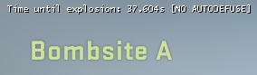
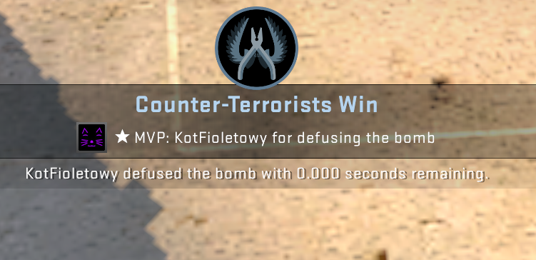

## 0s defuser





Exploit made by [@szmarczak](https://github.com/szmarczak).

Works the same as the [hitmarker](../hitmarker), but it checks `bomb_planted` instead.

All necessary commands are executed immediately when you run the script. The following commands are run:

```
developer 1;
con_filter_enable 2;
con_filter_text "Time until explosion: ";
bind 0 "echo defuse_0s_0";
bind - "echo defuse_0s_1";
bind = "echo defuse_0s_2";
```

Key description:
- `0` - disables autodefuse,
- `-` - enables 10s autodefuse (IOW without defuse kit),
- `=` - enables 5s autodefuse (IOW with defuse kit).

What's an autodefuse? If you have killed all of your enemies and have plenty of time, you can enable autodefuse. It starts defusing automatically so you will have a `0.000s` defuse time.

**Note:** Your crosshair must be pointed at the bomb.

### Requirements

* [Node.js 14+](https://nodejs.org/en/download/current/)

### Usage

Start CS:GO with `-netconport 2121` and then run `node 0s_defuser.js 2121`. Works offline and online.
